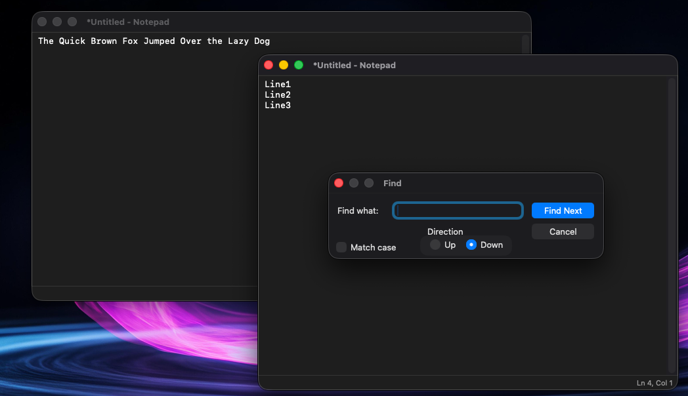

# MacNotepad

A native macOS text editor inspired by classic Windows Notepad, built with Swift and AppKit.



## Features

- **Multi-window editing** — File > New and File > Open each create a new window
- **Find / Replace** — Floating panel with match case and direction options
- **Go To Line** — Jump to a specific line number (when Word Wrap is off)
- **Word Wrap** — Toggle via Format menu; status bar appears when off
- **Font selection** — Format > Font opens the system font picker
- **Time/Date** — Insert current timestamp at cursor
- **Print / Page Setup** — Standard macOS print support
- **Status bar** — Displays current line and column position
- **Light/Dark mode** — Follows system appearance
- **Window position memory** — Remembers size and position across launches
- **Save prompts** — Warns before closing unsaved documents
- **Retro app icon** — Pixel-art notepad with pencil

## Classic Notepad Menu Structure

| File | Edit | Search | Format |
|------|------|--------|--------|
| New | Undo | Find... | Word Wrap |
| Open... | Cut | Find Next | Font... |
| Save | Copy | Replace... | |
| Save As... | Paste | Go To... | |
| Page Setup... | Delete | | |
| Print... | Select All | | |
| Exit | Time/Date | | |

## How to Build

Requires macOS 14.0+ and Xcode Command Line Tools.

```bash
./build.sh
open build/MacNotepad.app
```

To regenerate the app icon:

```bash
swift generate_icon.swift
```

## Architecture

Built following the same patterns as [MacWinFile](https://github.com/Jeff31UK/MacWinFile):

- **AppKit + SwiftUI hybrid** — NSTextView for editing, SwiftUI for the status bar
- **Explicit `main.swift`** — No NIB/storyboard, no `@main` attribute
- **Programmatic menus** — Full menu bar built in code
- **`swiftc` build** — No Xcode project required (`.xcodeproj` included for convenience)
- **Ad-hoc signed** — Right-click > Open on first launch to bypass Gatekeeper

## License

MIT
